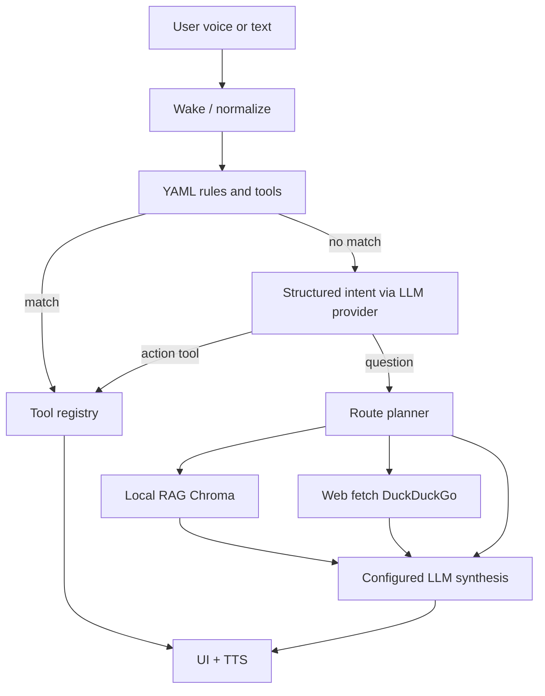

<!-- AI-ASSISTED: Cursor -->
<!-- PROMPT: Architecture doc for RAG, web, tools, and QE as modules -->
<!-- ACCEPTED-BY: vignesh -->

# RAYA orchestration

RAYA routes each utterance through a fixed pipeline. **QE Engine** is one integration module (tools + command-center node), not the core product.

## Request flow

## Route planner (`backend/agent/orchestrator.py`)

| Example | Route | Behavior |
|--------|--------|----------|
| What is my project location? | `rag` | Retrieve from `data/knowledge`, answer with the configured LLM provider |
| What is the weather today? | `web` | Fetch snippets, cite sources in reply |
| Open Chrome | `tool` | Rules or structured intent → registry (no RAG) |
| Latest AI news | `web` | Web fetch + summary |
| My notes + today's stock price | `rag_and_web` | Both contexts, one answer |
| Explain Selenium | `chat` | Configured LLM only (static knowledge) |

Personal signals: *my*, *my project*, *my notes*, etc.  
Current/external signals: *weather*, *news*, *latest*, *today*, *price*, etc.

## Local vs external

- **RAG**: Documents under `data/knowledge` and `RAYA_RAG_EXTRA_PATHS`. Embeddings and Chroma stay on the laptop; retrieved excerpts are included in prompts sent to the configured LLM provider.
- **Web**: Used when the planner selects `web` or `rag_and_web`. Mode `RAYA_WEB_SEARCH_MODE=fetch` (default) pulls snippets; `browser` only opens a search tab.
- **Tools**: Registered capabilities (browser, apps, QE Engine, RAG sync, …). Extend via new tool modules without changing the pipeline shape.

## API response hints

`ProcessResponse.data` may include:

- `route`: `chat`, `rag`, `web`, `rag_and_web`
- `route_reason`: short planner label
- `web_sources`: `{title, url}` list
- `execution.source`: same as route for knowledge turns

## Configuration

See `.env.example`: `RAYA_RAG_*`, `RAYA_WEB_SEARCH_MODE`, `RAYA_WEB_SEARCH_MAX_RESULTS`.
